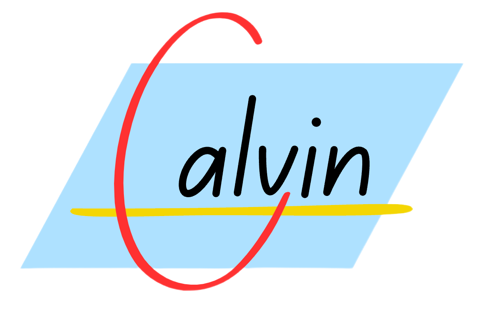

<p align="center"></p>

<div align="center">

<h3>Calvin</h3>

A superhuman chess engine written in Java.
<br>
 <br>
  <strong>[Download Calvin](https://github.com/kelseyde/calvin-chess-engine/releases)</strong> | <strong>[Report a Bug](https://github.com/kelseyde/calvin-chess-engine/issues)</strong>
 <br>
<br>

[![release][release-badge]][release-link]
[![lichess-badge]][lichess-link]
[![build-badge]][build-link]


</div>

## Overview

Calvin is a UCI-compatible chess engine written in Java. 

It features an alpha-beta search algorithm paired with a neural-network-based evaluation function. 

Calvin can play standard chess, fischer random chess (FRC) and double fischer random chess (DFRC).

My aim with this project was to combine my passion (playing mediocre chess) with my profession (writing mediocre code). My secondary goal was to learn about chess programming. I hope that my code is well-documented so that other developers and chess engine enthusiasts can learn as well. If you find some information is missing or poorly explained, please let me know!

## How to Play 

Calvin communicates via the [Universal Chess Interface](https://www.chessprogramming.org/UCI) (UCI), meaning you can run it via the command line or paired with your favourite chess GUI:

1. Download the latest release from [Releases](https://github.com/kelseyde/calvin-chess-engine/releases).
2. Ensure **Java 17+** is installed locally.
3. Start Calvin from the command line:

   ```bash
   java --add-modules jdk.incubator.vector -jar calvin-chess-engine-6.0.0.jar
4. Type "help" or refer to [UCI](https://www.wbec-ridderkerk.nl/html/UCIProtocol.html) documentation for further information on available commands.

## Strength 

|                                   Version                                   | Release Date |  🎯 Elo  | CCRL Blitz | CCRL Rapid | CEGT Rapid |
|:---------------------------------------------------------------------------:|:------------:|:--------:|:----------:|:----------:|:----------:|
| [6.0.0](https://github.com/kelseyde/calvin-chess-engine/releases/tag/6.0.0) |  2025-03-02  | **3600** |            |    3493    |            |
| [5.1.0](https://github.com/kelseyde/calvin-chess-engine/releases/tag/5.1.0) |  2025-01-16  | **3500** |    3501    |    3394    |    3344    |
| [5.0.2](https://github.com/kelseyde/calvin-chess-engine/releases/tag/5.0.2) |  2024-11-16  | **3400** |    3403    |    3312    |    3225    |
| [4.3.0](https://github.com/kelseyde/calvin-chess-engine/releases/tag/4.3.0) |  2024-10-05  | **3300** |    3332    |    3277    |     -      |
| [4.2.0](https://github.com/kelseyde/calvin-chess-engine/releases/tag/4.2.0) |  2024-09-19  | **3230** |     -      |    3224    |     -      |
| [4.1.0](https://github.com/kelseyde/calvin-chess-engine/releases/tag/4.1.0) |  2024-09-04  | **3150** |    3171    |    3161    |     -      |
| [4.0.0](https://github.com/kelseyde/calvin-chess-engine/releases/tag/4.0.0) |  2024-07-30  | **3000** |    3011    |    3029    |     -      |
| [3.4.0](https://github.com/kelseyde/calvin-chess-engine/releases/tag/3.4.0) |  2024-05-19  | **2500** |     -      |    2492    |     -      |
| [3.3.0](https://github.com/kelseyde/calvin-chess-engine/releases/tag/3.3.0) |  2024-05-10  | **2450** |    2453    |     -      |     -      |
| [3.2.0](https://github.com/kelseyde/calvin-chess-engine/releases/tag/3.2.0) |  2023-12-09  | **2250** |    2233    |     -      |     -      |
| [3.1.0](https://github.com/kelseyde/calvin-chess-engine/releases/tag/3.1.0) |  2023-12-05  | **2220** |     -      |     -      |     -      |
| [3.0.0](https://github.com/kelseyde/calvin-chess-engine/releases/tag/3.0.0) |  2023-12-02  | **2200** |     -      |     -      |     -      |
| [2.6.2](https://github.com/kelseyde/calvin-chess-engine/releases/tag/2.6.2) |  2023-11-12  | **2175** |    2173    |     -      |     -      |

## Features

Calvin features a traditional alpha-beta chess engine architecture. The engine can broadly be split into two parts: search and evaluation.

### Search

The search algorithm is all about exploring the possible positions in the game tree, in the most efficient manner possible. To achieve this Calvin uses a classical [alpha/beta](https://www.chessprogramming.org/Alpha-Beta) [negamax](https://www.chessprogramming.org/Negamax) algorithm. 

#### Search enhancements

- [Transposition table](https://www.chessprogramming.org/Transposition_Table)
- [Principal Variation Search](https://www.chessprogramming.org/Principal_Variation_Search)
- [Iterative Deepening](https://www.chessprogramming.org/Iterative_Deepening)
- [Quiescence Search](https://www.chessprogramming.org/Quiescence_Search)
- [Zobrist Hashing](https://www.chessprogramming.org/Zobrist_Hashing)
- [Aspiration windows](https://www.chessprogramming.org/Aspiration_Windows)
- [Lazy SMP](https://www.chessprogramming.org/Lazy_SMP)

#### Pruning, reductions, extensions

- [Null-Move Pruning](https://www.chessprogramming.org/Null_Move_Pruning)
- [Futility Pruning](https://www.chessprogramming.org/Futility_Pruning)
- [Reverse Futility Pruning](https://www.chessprogramming.org/Reverse_Futility_Pruning)
- [Delta Pruning](https://www.chessprogramming.org/Delta_Pruning)
- [Late Move Reductions](https://www.chessprogramming.org/Late_Move_Reductions)
- [Check Extension](https://www.chessprogramming.org/Check_Extensions)
- [History Pruning](https://www.chessprogramming.org/History_Leaf_Pruning)
- [Razoring](https://www.chessprogramming.org/Razoring)

#### Move ordering

- [MVV](https://www.chessprogramming.org/MVV-LVA) with [Capture History](https://www.chessprogramming.org/History_Heuristic#Capture_History)
- [Killer Heuristic](https://www.chessprogramming.org/Killer_Move)
- [History Heuristic](https://www.chessprogramming.org/History_Heuristic)
- [Continuation History](https://www.chessprogramming.org/History_Heuristic#Continuation_History) (1-ply and 2-ply)

#### Time Management

- Hard/soft time bounds
- Best move stability scaling
- Score stability scaling
- Node TM scaling

#### Communication
- Calvin communicates using the Universal Chess Interface [(UCI) protocol](https://www.chessprogramming.org/UCI).
- [Pondering](https://www.chessprogramming.org/Pondering), where the engine thinks on the opponent's move. Can be disabled using the 'Ponder' UCI option.
- Hash size and number of search threads are also configurable via UCI.
- Calvin is connected to Lichess where he plays regularly in the engine pool: https://lichess.org/@/Calvin_Bot

### Evaluation 

For any given chess position, the engine needs a method of obtaining an estimate of how good the position is for the side to move. Chess engine evaluation mechanisms can be split into two camps: traditional [Hand-Crafted Evaluation](https://www.chessprogramming.org/Evaluation) (HCE), and [Efficiently Updatable Neural Networks](https://www.chessprogramming.org/NNUE) (NNUE). Since version [4.0.0](https://github.com/kelseyde/calvin-chess-engine/releases/tag/4.0.0), Calvin has switched to a neural-net based eval. 

The positions that make up the dataset on which Calvin's neural networks are trained are taken from the open-source [Leela dataset](https://www.kaggle.com/datasets/linrock/t77dec2021-t78janfeb2022-t80apr2022). However, instead of using the Leela's evaluation as the training target, I re-score these positions with Calvin's own search score (using a 5k soft-node-limited search). Calvin therefore sits somewhere between engines whose data is fully self-generated and engines who use both the fen, score, and WDL from Leela data. 

Calvin's neural nets are trained using the incredible [bullet](https://github.com/jw1912/bullet) trainer developed by Jamie Whiting, which is state of the art for NNUE training and is used by most top engine authors.

## Credits

I am hugely grateful to the many people who have shared their knowledge and resources with me throughout Calvin's development. Without them, Calvin would be nowhere near the level it is at today. To name just a few people, places and things that I am thankful for:

- The Engine Programming and Stockfish Discord servers, both amazing resources for chess engine knowledge and full of patient, helpful people.
- Jamie Whiting, the author of [bullet](https://github.com/jw1912/bullet), an incredible tool for training NNUEs among other things, which I have used to train all of Calvin's neural networks.
- The [Chess Programming Wiki](https://www.chessprogramming.org) and [TalkChess forums](https://talkchess.com/), both a huge help in the early days of Calvin's development.
- Other engines - I have drawn inspiration from countless others' engines, including but not limited to: [Chess Coding Adventure](https://github.com/SebLague/Chess-Coding-Adventure) (whose Youtube video inspired me to write my own engine); [Stockfish](https://github.com/official-stockfish/Stockfish) (the queen of all engines); [Leorik](https://github.com/lithander/Leorik) (whose author keeps an excellent devlog on the TalkChess forum); [Lynx](https://github.com/lynx-chess/Lynx); [Simbelyne](https://github.com/sroelants/simbelmyne); [Stormphrax](https://github.com/Ciekce/Stormphrax); [Viridithas](https://github.com/cosmobobak/viridithas), and many more.

If you would like to contribute to Calvin, or just talk about chess/chess programming, get in touch!

[build-badge]: https://github.com/kelseyde/calvin-chess-engine/actions/workflows/build.yml/badge.svg
[build-link]: https://github.com/kelseyde/calvin-chess-engine/actions/workflows/build.yml

[release-badge]: https://img.shields.io/github/v/release/kelseyde/calvin-chess-engine?style=for-the-badge&color=FF5757
[release-link]: https://github.com/kelseyde/calvin-chess-engine/releases/latest

[lichess-badge]: https://img.shields.io/badge/Play-v6.0.0-FFDE59?logo=lichess&style=for-the-badge
[lichess-link]: https://lichess.org/@/Calvin_Bot

